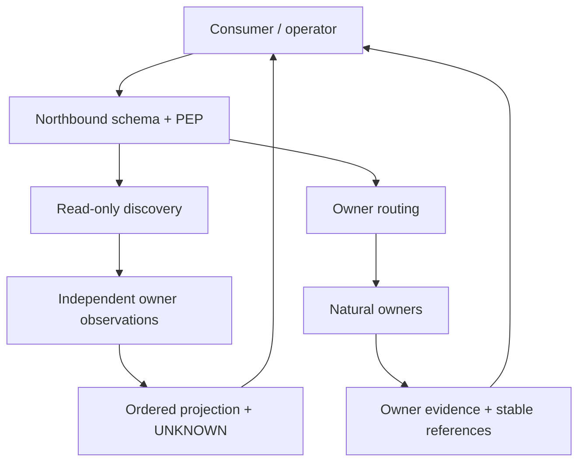

# Ordivon Gateway — Recursive LEGO R2.1 深度优化报告
观测窗口：2026-10-01 15:29–15:51 Asia/Shanghai。结论仅对下述 exact bindings 成立。

## A. Executive State

**当前状态：SOURCE_READY；整体生产优化尚未 CLOSED。** 已完成权威普查、问题重新表征、成熟模式对照、最小边界定位、实际源码优化、原生验证和独立复核。未发布到生产，未把局部测试结果升级为整体完成。

最有用的重新表征是：Gateway 不是一个由版本号唯一确定的服务，而是**具体 carrier、源码 release、配置、认证 ingress、client catalog 与 owner observation 的组合**。同为 0.8.0 的观测不自动可比较。

本轮证据明确、可逆、低耦合的改动：移除能力普查对独立 owner 的串行等待，增加每个只读观测的协作取消预算，保留原有接口、确定性排序、请求内去重和 UNKNOWN 语义。固定 100 ms/owner 的受控测量由 308.24 ms 降到 101.03 ms，约下降 67.2%，相同输入输出 digest 未变。此数值不是生产 p95，也不能证明用户端到端快了 67%。

当前最大的阻断是**所选连接器与 carrier/配置/catalog 的当前绑定不充分**：首轮插件报告 Runtime/Skills 未配置；本地 Linux 进程有这些 owner URL；随后插件工具调用出现 -32603，而直接 Host owner 完整性正常。尚无证据把故障归因到 Gateway、代理、连接器或某次部署中的单一组件。

## B. Current Truth / ProblemSpec

### 事实与当前性

| 类型 | Claim | Source / currentness | Scope / confidence |
|---|---|---|---|
| FACT | 首轮插件 Gateway 0.8.0；Runtime linux/windows 与 Skills configured=false；Host=true | system.describe / capability.describe，15:29 附近；projection digest sha256:54eacfc892805678af7190dc7038b137d758339940896dc8692cb42aaa74fc9e | 本次插件观测；高 |
| FACT | Linux/Windows Runtime 直接 owner 均能返回 Workspace inventory | 两个 Runtime workspace.list，15:29–15:30 | owner 可响应，不等于 Gateway 可路由；高 |
| FACT | 源码起始 main=6549bca0a90676784bb9fe43e29c76b395782ba7 | Runtime workspace.open + Git HEAD | 起始源码 fence；高 |
| FACT | Gateway 最近源码 owner 变更=59969bdb30a1c93b67770b6294a1d53793101948 | Git path history | 源码 lineage，非运行时证明；高 |
| FACT | Linux Gateway active，PID 1117，current release=59969bdb…；/health=ok | systemctl、/proc 仅白名单 URL 配置、release symlink、health，15:34 附近 | Linux carrier；高 |
| FACT | Linux进程有 linux=127.0.0.1:8897、windows=canary-mcp.ordivon.com、host=127.0.0.1:8898、skills=127.0.0.1:8895 的配置地址；PDP endpoint 未配置 | 相同 PID 的非秘密配置白名单 | 配置存在不等于认证、owner 可用或授权成立；高 |
| FACT | 源码 manifest=0.8.0 / epoch5 / 37 tools；本次会话工具 registry 只暴露 36 个 Gateway tools，缺 capability.resolve | mcp-surface.json digest sha256:64497e48728de800cbe17449cb5c08a82f459ad9e08c3732e6470d212e2e4a8e；ALL_TOOLS 精确前缀集合 | catalog seam；高；未证明平台为何省略该 tool |
| FACT | 后续 Gateway actor.declare、host.status、system.describe 调用返回 -32603 Internal error | 实际插件调用，15:36–15:38 | connector-call failure；高；组件根因未知 |
| FACT | 直接 Host schema10 完整性 healthy，全部6项检查正常 | Host natural owner integrity，15:38 | Host semantic/PG state；不能证明 Gateway/Runtime；高 |
| FACT | 当前 R2.1 skill 已实际读取，digest=1985dc2765bda250b1f2f76e1b85425141e6aadbb7e39ef5bd5b92d063f08c09 | .agents/skills/recursive-lego-calculus/SKILL.md | 方法绑定；高 |
| FACT | 安全源码候选=1a1c659b31aa71d4e585d6bc19609907e4a83c5e，代码 patch=75c747c040973d33fa312dbca99b857287a1eabb | 隔离 Runtime workspace；Git readback | candidate，不是 primary/provider/live；高 |
| FACT | 最终 Gateway native recipe 全部通过，133项测试，Ruff/format/lock通过 | job-01a0f671-bfeb-7fa3-bd8c-c821cb663a64 | 源码/SDK可控环境 verification；高 |
| INFERENCE | 仅用 package version 表示 Gateway currentness 不充分；至少有不同配置/观测路径 | 上述插件、进程及catalog不一致 | 表征缺口；高；不推出单一故障根因 |
| ASSUMPTION | 所需 owner 读探针无 effect，允许并行；本轮选定 Runtime describe 与 Host summary status | 现有 owner合同与直接源码 | 本次观测集合；新增owner须重新检查 |
| UNKNOWN | 插件当前真实 carrier、认证principal、实际release路径、故障层 | 当前未获完整 owner-native binding | 不以本地 carrier 替代 |
| UNKNOWN | 生产延迟分布、吞吐、并发压力、SDK实际网络清理上界 | 尚无目标workload measurements | 不编造收益 |

CurrentnessFence 不应是一枚全局版本号。对实际决策使用：
源码 SHA / owner tree、具体 endpoint/carrier、非秘密配置身份、认证路径、client catalog digest、owner node/provider identity、观测时间与 scope。凭据本身、凭据 digest 和原始秘密不得进入报告或 Host。

### ProblemSpec

- objective / φ：consumer 能迅速发现与其当前合法路径匹配的能力，安全路由到自然 owner；失败可解释、response loss 可恢复，不重复真实 effect。
- current_state：稳定 northbound 已存在；部分 carrier 配置与 client surface 不一致；能力发现有独立探针串行等待；当前插件后续调用失败。
- desired_state：thin adapter；发现与授权分离；独立只读观测局部失败；具体 release/config/catalog 可验收；执行仍保留 requestId/operationRef 与 owner evidence。
- consumers：ChatGPT/Harness/Agent，恢复中的 operator，Runtime/Host/Skills/domain provider。
- constraints：可逆小步、已有 owner合同优先、标准SDK、保留opaque provider context、避免新数据库/Registry/调度器。
- invariants：Gateway 不拥有 Runtime Job truth、Host Work truth、Security issuer、domain completion；configured≠available≠authorized；UNKNOWN≠FAIL；job terminal≠external effect converged。
- authority：Git source/publication自然 owner；Runtime物理执行；Host continuity；Security身份/PDP/effect admission；Gateway只做入口PEP与路由。
- success：精确候选可验证，目标carrier/readback与真实workload成立；failure：错误授权、重复effect、观测失真；stop：稳定最小frontier且安全源码已就绪，未决生产边界显式隔离。

ψ 本轮仅是“独立观测并行、请求内owner一次、序列/digest稳定、超时和取消正确传播、原生suite通过”。ψ→φ 是**局部桥**，不覆盖连接器绑定、生产鉴权、真实延迟或外部effect。

## C. External Mature Patterns

| 模式 | 采用/适配 | 边界与不采用 |
|---|---|---|
| MCP 2026-07-28官方SDK、无状态核心、显式handle、稳定catalog和cache hints | 保留现有 mcp 2.2.0 Client(mode=auto)；以标准catalog/订阅机制作为刷新owner | 不自写协议；不把旧2025 list_changed机制直接套到2026；client是否刷新仍需实际验收 |
| OpenID AuthZEN Authorization API 1.0 | KEEP既有Gateway PEP与可替换Security PDP接口 | permission≠effect admission；本地Linux PDP endpoint未配；不创建Gateway IAM或Credential Vault |
| Python structured concurrency / TaskGroup | ADAPT用于有限、独立的只读owner探针；子任务生命周期附着本次请求 | 不并行effect，不加后台调度，不跨请求缓存 |
| AWS Builders Library 幂等请求语义 | KEEP request identity和response-loss先reconcile | Gateway request replay不证明provider effect幂等；不自动重试不确定effect |
| Envoy per-upstream isolation / retry budgets | 采用局部失败与有界等待思想 | 没有规模/排队证据，不部署新mesh，不加万能breaker |
| OpenTelemetry RPC标准 | KEEP现有trace correlation；后续由观测owner测per-owner/critical-path/恢复延迟 | 暂不加metrics DB、dashboard或高基数principals标签 |

一手资料（2026-10-01核对）：
- https://blog.modelcontextprotocol.io/posts/2026-07-28/
- https://openid.net/specs/authorization-api-1_0.html
- https://aws.amazon.com/builders-library/making-retries-safe-with-idempotent-APIs/
- https://www.envoyproxy.io/docs/envoy/latest/intro/arch_overview/upstream/circuit_breaking
- https://opentelemetry.io/docs/specs/semconv/rpc/rpc-metrics/

没有证据支持整套替换成Envoy、Effect框架、Temporal workflow或新统一Capability Registry。成熟外部机制用于解决明确seam，而不是为了“采用成熟技术”增加系统。

## D. Current Recursive LEGO Graph

这些是任务相关的接口边界，不是把Python文件名当LEGO；不主张数学basis完备性。

| LEGO / owner | I→O / state | pre/post/invariants | effects、成本、failure/evidence |
|---|---|---|---|
| Northbound envelope / Gateway | MCP tool args→typed result；static surface | schema有效；稳定action名；provider context opaque | JSON/schema成本；协议/域错误分离；manifest |
| Ingress PEP / Gateway消费Security合同 | verified principal+request→allow/deny | trust-anchored identity；不以tool args自证身份 | PDP延迟；fail closed；decision trace；非issuer |
| Discovery composer / Gateway | selected routes+owner observations→projection | 只读；不授权；order/digest确定；UNKNOWN保留 | 本轮改动；request-local state；owner errors可见 |
| Owner call adapter / Gateway | endpoint+tool args→owner response | 配置与机器认证由合法owner提供；标准MCP client | network、transport cleanup、credential私密使用；OwnerCallError |
| Reference / evidence adapter / Gateway | requestId/owner native ID→operationRef/readback | 不将execution success当semantic success | response loss先resolve；artifact/owner证据链 |
| Host / Runtime / Skills / Security / domains | 各自自然接口 | authority不因穿过Gateway而迁移 | 独立lifecycle/failure；Gateway保留provenance |

可选 external.pull 有自己的SQLite lease/attempt delivery state、签名与worker生命周期；它是已存在的delivery extension，不是通用MCP provider，也不获得domain authority。本轮未重构它，因为没有证据表明它阻止当前φ。

关键关系：Gateway REQUIRES owner接口；Security AUTHORIZES Gateway PEP；Gateway ROUTES/DATA owner；owner PROVIDES observation/EVIDENCE；ExecutionResolution RECONCILE_AFTER response loss；Host保存Work continuidade，不VERIFIES物理或domain完成。

## E. Minimal Broken Frontier

本轮可证最小frontier有两个不可互相代替的成员：

1. **F-observation**：独立owner观测存在串行CONTROL边；一个慢owner拖长完整发现；缺本层观测取消预算。归因已由源码与可重复fixture确认。
2. **F-binding**：client catalog、实际carrier/release/config/ingress与owner投影缺完整可比较binding；随后实际插件调用失败。根因未完全隔离，不允许猜测式修复。

Security生产issuer、跨OS机器凭据、provider授权和外部effect qualification由已有生产closure Work承接，历史locator不能当当前FAIL。本轮未重新声明它们全部失效，也没有为旧清单再创建Work。

## F. LEGO Optimization

- 属性：KEEP路由、type与owner边界；明确“projection不是authorization”。
- 性能：并行有限独立read probes，把Σlatency改成主要受max(owner latency)约束；不改善单owner网络本身。
- 可靠性：独立timeout/transport失败生成observation_error，健康owner仍可见；请求TaskGroup取消/等待子探针。
- UX：维护者能区分未配地址、未配认证、观测失败与已证明不可用；README纠正旧continuity工具名和“host.status未暴露”的过期描述。
- 生命周期：探针只属于请求；无全局memo、无后台Job；下一请求重新观测；只读查询和effects生命周期分离。
- Evidence：exact inputs的projection digest保持；测试、benchmark、独立review、SDK试验都绑定candidate与scope。
- Authority：effect admission/Runtime/Host都未移入发现模块。

新增复杂度只有一个正有限的service observation cancellation参数和请求TaskGroup；删除重复异常处理与跨owner串行等待。没有增加tool、服务、数据库、Agent pool、policy层或工作流。

## G. Composition Optimization

DELETE：Linux观察完成→才启动Windows观察→才启动Host观察的非必要CONTROL关系。

KEEP：每个owner的真实postcondition和projection构造关系、固定顺序、request-local result reuse、requestId/native operation归一化、owner-auth检查。

ADAPT：用TaskGroup表达同一请求内独立read observations；每个Runtime owner一次，artifact和execution复用同一观测；selected capability不查询无关owner。

STANDARDIZE：MCP目录/release manifest、Security AuthZEN、OTel trace；不另立协议。

DEFER：HTTP connection pooling、跨请求projection缓存、全局singleflight、服务级breaker、search预筛选；目前无足够生产attribution。缓存尤其会增加credential rotation、legacy session、stale truth和跨principal隔离成本。

## H. Target Architecture

这是现有功能关系的收敛，图中节点不代表新增进程。更简单的原因：减少人为串行边和重复异常处理，不引入跨请求state；更强的原因：partial failure仍返回健康owner；更可靠的原因：任务生命周期与请求一致，authority不迁移。F-binding仍需carrier owner完成精确验收。

## I. Executable Work Graph

只新增一个独立生命周期的Work：
**work:gateway:observation-boundary-optimization-r21:20261001**。
生产组合继续引用既有 **work:gateway:capability-provider-production-closure-r2-20260930**，避免duplicate production Work。

### WC-observation（新Work，source READY）

- Objective / DesiredProductState：减少能力发现不必要的等待；候选具备可验证的并行观测与UNKNOWN传播。
- NaturalOwner / TruthAuthority：services/gateway source；Git拥有源码；Runtime拥有Job；Host只保存Work状态。
- Inputs：fenced Gateway owner tree、R2.1、标准SDK、owner contract、基线fixture。
- Outputs：candidate、README、behavioral/SDK tests、benchmark与receipt。
- Preconditions：仅read probes可并行；source隔离；正有限取消预算。
- Guarantees / Invariants：每owner每请求一次、确定顺序、下一请求fresh；不改变execution/effect admission。
- EffectAuthority：隔离workspace可逆source修改；无live release authority竞争。
- Verifier / ψ：native recipe+事件屏障并发测试+真实SDK MockTransport timeout/cancel。
- Evidence：上述exact Jobs，133 suite，benchmark digest，独立review。
- ψ→φ：只证明观测seam；生产总体φ仍有F-binding与workload qualification。
- CurrentnessFence：code 75c747c…，follow-up 1a1c659b…，base e0d46f7…；当前main继续移动，publication前必须再核owner diff。
- FailureSemantics / Recovery：transport/timeout UNKNOWN；external取消清理子task；源码失败回到exact base；不盲重effect。
- StopCondition：source review与owner verify成立就停止扩写。
- Dependencies / Publication：依赖已有Git/structured-release owner；保留candidate branch与workspace；主干和live没有由本轮改动。

### WC-carrier（复用既有production Work，当前UNKNOWN / READY_CENSUS）

- Objective：同一consumer路径下catalog、release/config/ingress与owner投影可比较且能工作。
- Inputs：client 36-tool观察、37-toolmanifest、Linuxrelease及URL元数据、插件失败、直接Host健康。
- Outputs：exact carrier身份与配置证明、catalog/readback、typed故障归因。
- NaturalOwner：Gateway carrier/ingress部署owner + client connector owner；Runtime/Host各自提供自己的truth。
- Preconditions：明确实际endpoint/process/release/profile；存在合法机器凭据和鉴权，不将“配置存在”作授权。
- Guarantees / Invariants：不暴露secret；不争抢并发release；不假设刷新发生。
- EffectAuthority：观察优先；shared release需合法owner串行执行、rollback。
- Verifier / ψ：相同client工具列表与manifest比对；相同ingress能力查询；owner-node binding；合法轻量canary/readback。
- ψ→φ：catalog一致只证明可发现，不证明可调用；canary不证明所有effect。分别记录bridge。
- Failure / Recovery：connector故障不证明Host故障；保留direct-owner恢复；不自动复制凭据或重启所有服务。
- CurrentnessFence：重新观测后绑定；不得沿用本报告时间窗的live结论。
- StopCondition：目标profile全部验收后CLOSED；否则明确owner修复入口和residual。
- Dependencies：现有生产closure、Gitpublication、合法Credential/Identity owner。
- Publication / Handoff：本报告和新Work交给既有closure coordinator；不重新创建IAM/Registry。

两cell的认知与证据可并行，shared live effects串行；source性能优化不等待全系统IAM完成，但不能因此声称production完成。

## J. Execution

已实际完成：
1. 隔离workspace建立与R2.1实际读取。
2. owner/source/runtime/配置/catalog观测；历史Work只作为locator。
3. controlled基线复现。
4. 先写behavioral tests，看8项预期失败（另1项现有行为已成立），再写最小生产改动。
5. owner环境用uv --locked重新建立；初次复用primary旧venv导致0.7/0.8 metadata错配已被识别并纠正，未修改产品代码迎合错误环境。
6. implementation、format、owner suite、controlled remeasurement、independent review。
7. 加真实McpOwnerCaller+SDK mock HTTP transport的timeout/cancel regression，并修正文档。
8. 精确Git commits，Host durable Work；SDK cleanup限制保留。

未执行生产secret materialization、服务重启或Gateway live cutover。当前插件调用失败且真实carrier未绑定，shared-effect前置条件不完整；已推进到SOURCE_READY。

## K. Verification / Validation / Qualification

**Verification PASS**：最终133 tests、Ruff、format、lock。现有Starlette/AnyIO弃用warning仍存在，与本改动无关；不称“零warning”。

**Validation（局部）PASS**：相同3 owner fixture由308.24→101.03 ms，digest完全一致；单Windows查询100.32→100.63 ms，正常测量噪声范围，说明不是单owner加速。

**Independent review**：对e0d46f7..75c747c精确diff与实际SDK复核，无Critical/Important；建议保留SDK boundary regression，已落实。

**Qualification（SDK可控环境）PASS / 有边界**：
reviewer实际MCP2.2 MockTransport：0.3s cancellation预算 + 0.5s legacy DELETE cleanup→0.803s返回UNKNOWN；显式cancel+0.15s DELETE→0.151s传播CancelledError；均零残余asyncio task。
新的事件屏障测试直接验证实际SDK清理被await，取消后无残余。预算是**协作取消触发器，不是整个RPC硬wall-clock上界**。默认SDK HTTP read timeout 300s可能影响legacy cleanup；生产网络路径、ownerSDK模式和清理延迟尚UNKNOWN。

**Production qualification UNKNOWN**：真实p50/p95/p99、concurrency、目录刷新、同principal调用、release rollback、跨providereffect尚未在目标carrier证明。本轮未用测试PASS遮盖这些缺口。

## L. Residual Frontier B_min'

| 状态 | Frontier | 下一合法动作 |
|---|---|---|
| SOURCE_CLOSED / DELIVERY_READY | independent probe serialization + request lifecycle | exact candidate已实现/验证；通过已有Gitpublication与structured release送达 |
| READY | candidate publication/live qualification | 重核当前main owner tree、publication担当、targetcarrier/profile、rollback；再执行 |
| UNKNOWN | 插件调用-32603的根因与carrier绑定 | 精确核connector→ingress→process→release/config，不先全系统重启 |
| UNKNOWN | 36 vs37 catalog差异 | client/server确切列表与schema readback；不能以版本号宣布刷新完成 |
| UNKNOWN | 真实latency/SDKcleanup envelope | 目标workload测量，归因到owner/network/cleanup；不凭fixture给生产SLO |
| DEFERRED | pooling、跨请求cache、globalbreaker、服务大拆分 | 有production attribution与complexity收益后才重入 |

B_min'已从“优化整个Gateway”收缩为“候选送达与目标consumer/carrier绑定”。没有证据要求整套重写。

## M. Handoff / 最短恢复入口

1. Runtime workspace：**ws-gateway-optimization-r21-20261001**；sourceRepo=/root/projects/ordivon。
2. code patch：**75c747c040973d33fa312dbca99b857287a1eabb**；含SDK regression/doc的candidate：**1a1c659b31aa71d4e585d6bc19609907e4a83c5e**。
3. canonical report：services/gateway/planning/GATEWAY_RECURSIVE_LEGO_R21_OPTIMIZATION_20261001.md；WorkCell详细字段在本报告I。
4. Host新Work：work:gateway:observation-boundary-optimization-r21:20261001；复用production Work：work:gateway:capability-provider-production-closure-r2-20260930。
5. 下一合法动作：读取workspace精确head/digest和当前main；检查Gateway owner diff与现有publication/releaseowner；保持source证据与live主张分离；对实际client/ingress/carrier核identity/catalog，再structured release/readback。
6. 禁止重复：不要重新写并行探针；不要恢复旧Mega Gateway/Registry；不要把初次错误venv失败当新产品bug；不要读取/手搬凭据；不要将本地Linux health当插件carrier验收；不要将request replay当external effect幂等。

关键receipt：
- Census source：job-01a0f65e-e915-7831-8fec-e8168843c979
- Baseline timing：job-01a0f660-8d85-76b0-b663-18c823914938
- Live Linux topology：job-01a0f663-3299-76f3-84cd-972633ca02d3
- RED：job-01a0f662-bf09-7c10-bff0-1bdae6ce285a
- First native verify：job-01a0f664-ab12-7f92-9691-58eafed926e0
- Post timing：job-01a0f665-5945-7e73-9876-3ce765079954
- Review SDK timeout：job-01a0f66a-45f6-7fc1-870b-d3039277a875
- Review SDK cancellation：job-01a0f66a-dab5-7bd2-9800-203d0c571354
- Retained SDK regression：job-01a0f671-7531-7861-a5b8-f0a58f4e101a
- Final native verify：job-01a0f671-bfeb-7fa3-bd8c-c821cb663a64

本报告是evidence-bound representation与handoff，不是生产系统本身，也不替代自然owner事实。
